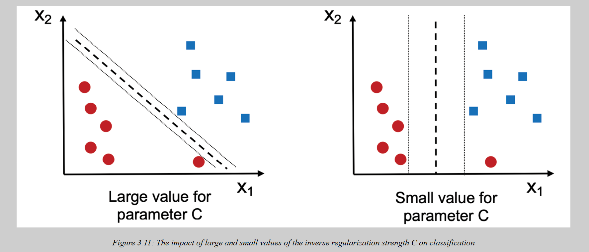
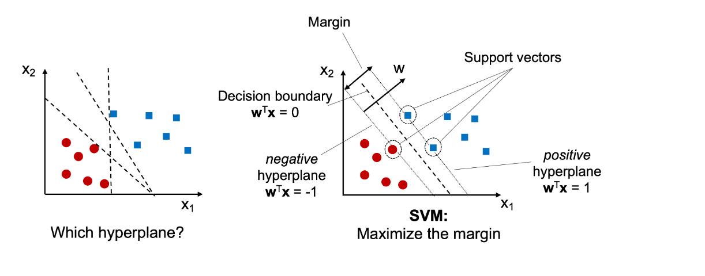
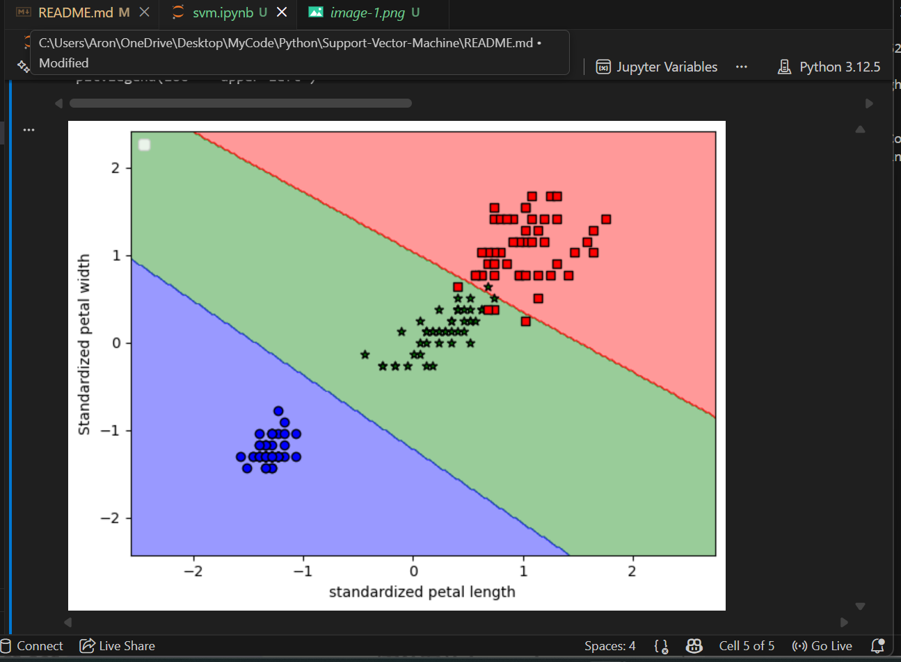
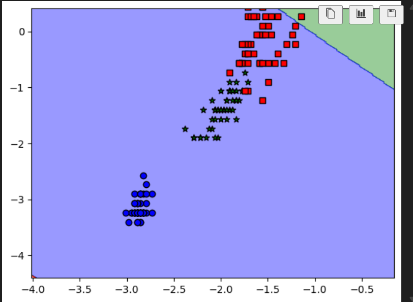
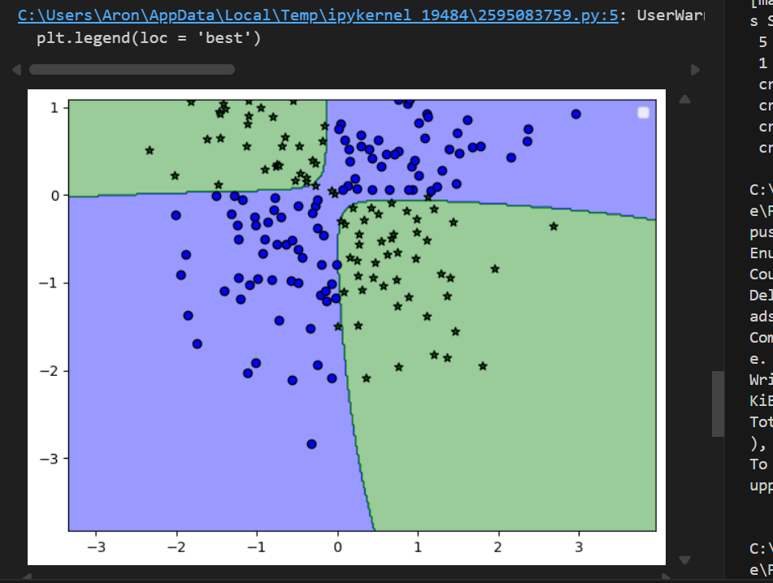
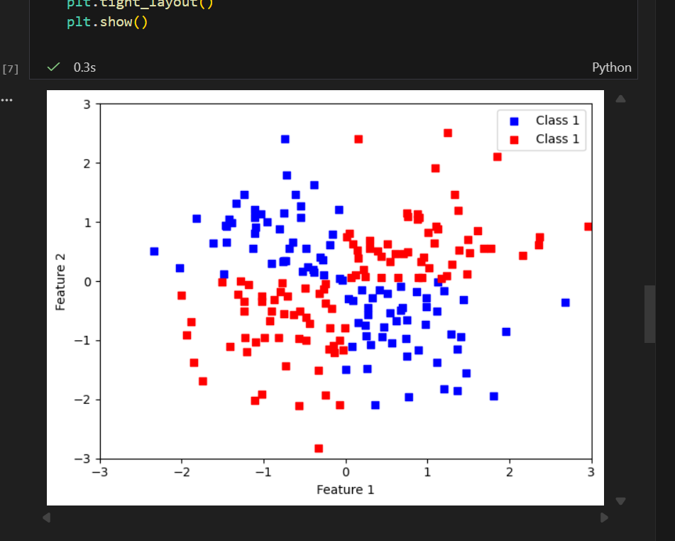
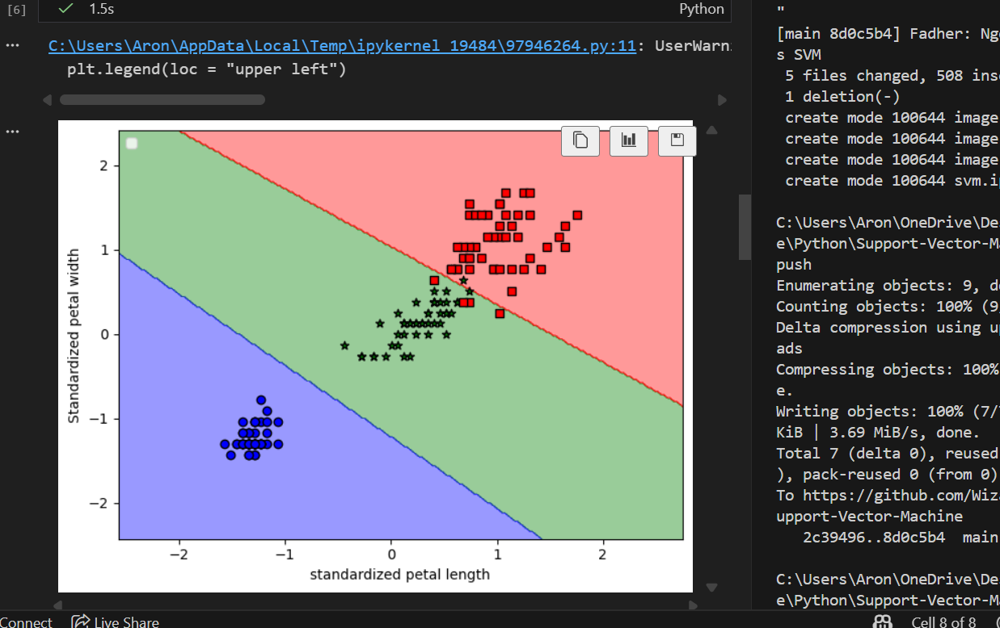

# Support-Vector-Machine

difference between the hyperparamenter controlling the misclassifification 

Common Knowdedge on SVM: 
SVM Was able to presend the standardized data 

Here are some images when run: 

